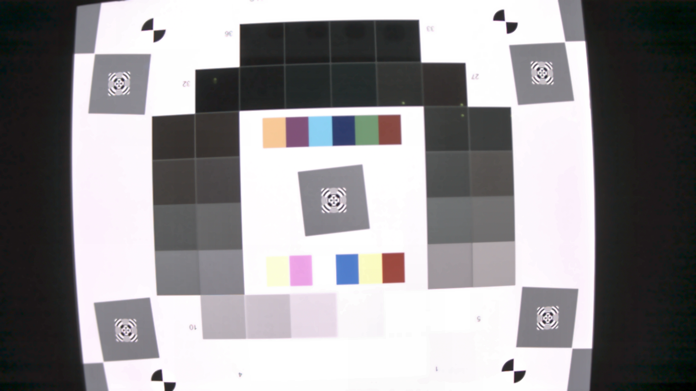

# ISP-AutoTuning
An ISP parameter auto-tuning script for presentation.

Tuning target

Tuning test.raw `[nlm.h & eeh.edge_gain] ` for 50 iterations

## What based on ?
* [fast-OpenISP](https://github.com/QiuJueqin/fast-openISP), a simple but efficient isp-pipeline implemented by python.

* [OpenBox](https://github.com/PKU-DAIR/open-box), OpenBox is an efficient system designed for generalized Black-box Optimization (BBO).
* IQA metrics, full-reference metrics include [LPIPS](https://github.com/richzhang/PerceptualSimilarity), PSNR, SSIM.

## What Used for ？
A simple project to tune ISP parameters of raw image automatically for better image quality.

## Run
`python run_auto_tuning.py`
